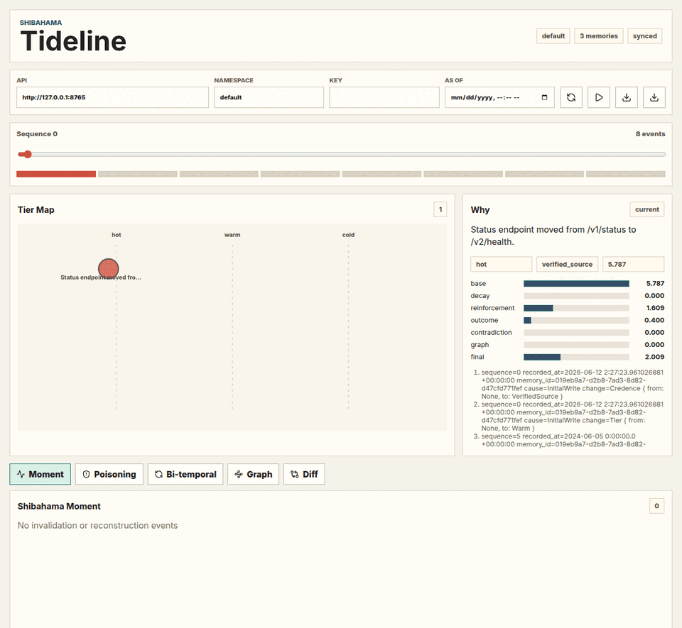
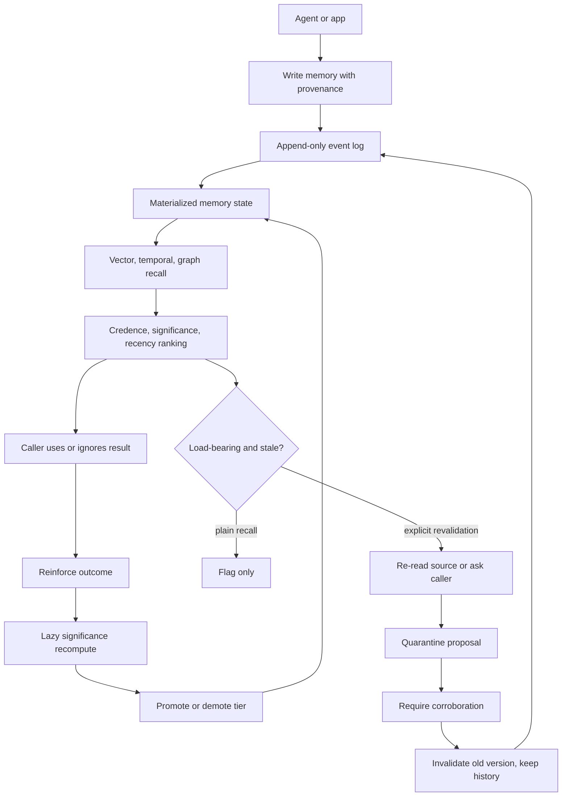

# Shibahama

<p align="center">
  
</p>

<p align="center">
  <a href="https://github.com/gongahkia/shibahama/actions/workflows/ci.yml"></a>
  
  
  
  
</p>

Usage-aware, reconstructive memory for long-running LLM agents.

Shibahama is built for the failure mode where an agent can retrieve old context
but cannot tell whether that context is still current, trusted, load-bearing, or
safe to use. It keeps memory as durable state with history: every item carries
provenance, valid time, ingestion time, credence, tier, significance, and an
audit trail. Recall returns contextual candidates, not bare text.

The repository is pre-release. The Rust core, CLI, Python binding, Node binding,
benchmark harness, examples, Tideline debugger, consolidation pass, human signal
verbs, and read-only learned-policy gates are implemented locally. PyPI, npm,
and final registry publication are still pending release credentials.

## Table of Contents

- [Quick Start](#quick-start)
- [What Shibahama Does](#what-shibahama-does)
- [API Surface](#api-surface)
- [Examples](#examples)
- [How It Works](#how-it-works)
- [Runtime Modes](#runtime-modes)
- [Benchmark Snapshot](#benchmark-snapshot)
- [Security Posture](#security-posture)
- [Documentation](#documentation)
- [Development & Evaluation](#development--evaluation)
- [Repository Layout](#repository-layout)
- [Release State](#release-state)
- [License](#license)

## Quick Start

Published packages are not available yet, so use the repository directly.

Run the Rust example:

```bash
cargo run --manifest-path examples/rust/quickstart/Cargo.toml
```

Build the Python binding and run the Python example:

```bash
python -m venv .venv
. .venv/bin/activate
python -m pip install --upgrade pip maturin
(
  cd bindings/python
  python -m maturin develop
)
python examples/python/basic_memory.py
```

Build the Node binding and run the Node example:

```bash
(
  cd bindings/node
  npm install
  npm run build
)
node examples/node/basic-memory.mjs
```

Try the CLI:

```bash
cargo run -p shibahama-cli -- init --path shibahama.redb --dimensions 2
cargo run -p shibahama-cli -- write \
  --path shibahama.redb \
  --content "Project prefers boring, durable storage." \
  --vector "0,1" \
  --source-kind user
cargo run -p shibahama-cli -- recall \
  --path shibahama.redb \
  --query-vector "0,1" \
  --top-k 1
```

## What Shibahama Does

- Stores memories with mandatory provenance and bi-temporal validity:
  `valid_from`, `valid_to`, and `ingested_at`.
- Separates credence from retrieval score so authoritative memories cannot be
  buried by low-trust but similar snippets.
- Computes usage-driven significance from access history, outcomes, decay,
  contradictions, and optional graph centrality.
- Moves memories through hot, warm, and cold tiers to control default retrieval
  cost without deleting history.
- Recalls by vector similarity, valid-time filtering, credence ordering,
  significance weighting, recency, and graph expansion.
- Flags stale but load-bearing memories for explicit revalidation.
- Reconstructs memory through a gated flow: re-read source, quarantine proposal,
  require corroboration, then invalidate old versions without overwriting them.
- Consolidates offline by merging duplicate memories with provenance, promoting
  or demoting tiers, and flagging stale important memories.
- Records human signals through `challenge`, `affirm`, `correct`, `pin`, and
  `unpin`, all as append-only audit events.
- Exposes read-only learned-policy gates that can evaluate candidate decisions,
  plan a disabled Stage 2 shadow experiment, and assess Stage 3 research
  readiness without training or mutating runtime state.

Shibahama is not a replacement for plain RAG on stateless one-shot QA. If the
whole useful corpus fits cheaply in context, if answers do not depend on
supersession or current validity, or if nearest-neighbor snippets are enough,
Shibahama's event log, credence, tiering, and reconstruction machinery may be
unnecessary. The benchmark boundary is documented in
[`docs/null-hypothesis.md`](./docs/null-hypothesis.md).

## API Surface

Core memory operations:

- `write`
- `write_with_embedding`
- `recall`
- `stream_recall`
- `timeline`
- `stream_timeline`
- `reinforce`
- `why`
- `why_at`
- `invalidate`

Offline and human-in-the-loop operations:

- `consolidate`
- `challenge`
- `affirm`
- `correct`
- `pin`
- `unpin`
- `evaluate_offline_policy`
- `plan_contextual_bandit_experiment`
- `assess_stage3_training_readiness`

Inspection and maintenance:

- `memory_items`
- `event_records`
- `audit_trail`
- `snapshot`
- `restore`
- `verify_never_delete_invariant`

Optional server mode:

- `GET /health`
- `GET /ready`
- `POST /write`
- `POST /recall`
- `POST /reinforce`
- `GET /why/{id}`
- `GET /tideline/snapshot`
- `GET /tideline/recording`
- `GET /tideline/live`

Generated API notes live in [`docs/api/`](./docs/api/).

## Examples

Use the Rust core directly:

```rust
use shibahama_core::api::{Shibahama, WriteEmbedding};
use shibahama_core::model::{AccessOutcome, Provenance, SourceKind};
use shibahama_core::storage::MemoryWriteEvent;
use shibahama_core::vector::HnswVectorIndex;
use time::OffsetDateTime;

let mut engine = Shibahama::open("memory.redb", HnswVectorIndex::new(2))?;
let now = OffsetDateTime::now_utc();

let item = engine.write_with_embedding(
    MemoryWriteEvent::new(
        "Do not suggest the legacy queue migration again.",
        Provenance::new(SourceKind::User, Some("retro-notes".to_owned()), "agent"),
        now,
        now,
    ),
    WriteEmbedding {
        vector: &[0.0, 1.0],
        index_name: "default",
        model: "caller-embedding-model",
        model_version: "v1",
    },
)?;

let request = engine
    .recall_request(&[0.0, 1.0], 5, now)
    .with_raw_query_context("queue migration options");
let recalled = engine.recall(&request)?;

engine.reinforce(item.id, AccessOutcome::Cited)?;
let why = engine.why(item.id)?;
```

Run a local CurrencyBench comparison after building the Python binding:

```bash
python benchmarks/run.py \
  --suite currencybench \
  --systems shibahama,warehouse \
  --output benchmarks/results/currencybench-local.json \
  --markdown benchmarks/results/currencybench-local.md
```

Start the optional server and Tideline debugger:

```bash
cargo run -p shibahama-cli -- serve --path shibahama.redb --dimensions 2 --api-key dev
(
  cd tideline
  npm install
  npm run dev
)
```

Open the Vite URL and point it at `http://127.0.0.1:8765` with API key `dev`.

For complete runnable snippets, see [`examples/`](./examples/).

## How It Works

Shibahama has six main runtime pieces:

1. The Rust core in [`core/`](./core/) owns memory semantics, significance,
   reconstruction, consolidation, human signals, storage, graph, and vector
   integration.
2. The redb-backed storage layer keeps an append-only event log plus current
   materialized memory state.
3. The retrieval orchestrator combines vector search, temporal filtering,
   credence ordering, significance, recency, graph expansion, diversification,
   and token budgets.
4. The reconstruction layer gates stale-memory revalidation, quarantines
   proposals, requires corroboration, and preserves superseded history.
5. The bindings and CLI expose the same core through Rust, Python, Node, and an
   optional HTTP server.
6. Tideline in [`tideline/`](./tideline/) replays events visually so users can
   inspect why memory changed.

Core flow:



Ordinary recall is read-only except for surfaced access recording.
Reconstruction does not run as an invisible side effect of a plain read.

## Runtime Modes

### Embedded Core

Use the Rust crate directly with an in-process vector index:

```bash
cargo test -p shibahama-core
```

The embedded mode is the source of truth for memory semantics. It is suitable
for local agents, test harnesses, and applications that want direct control of
their embedding model and storage path.

### Bindings

Python and Node bindings expose the core API from local builds:

```bash
scripts/ci/python-binding-smoke.sh
scripts/ci/node-binding-smoke.sh
```

Registry publication is not complete yet, so `pip install shibahama` and
`npm install shibahama` are release blockers rather than current install paths.

### Server

The optional server wraps the same core API for process boundaries, namespaces,
API-key auth, metadata-only logs, and Tideline streams:

```bash
cargo run -p shibahama-cli -- serve --path shibahama.redb --dimensions 2 --api-key dev
curl -H "x-api-key: dev" http://127.0.0.1:8765/ready
```

## Benchmark Snapshot

Checked-in local benchmark artifacts are under
[`benchmarks/results/`](./benchmarks/results/). These are deterministic local
smoke results, not hosted all-systems claims.

CurrencyBench injects fact changes mid-stream and measures whether the memory
system returns the current fact rather than the stale one:

| Suite | System | Queries | Accuracy | Stale Answer Rate | Mean Token Cost | p95 ms | Status |
|---|---|---:|---:|---:|---:|---:|---|
| currencybench | shibahama | 12 | 1.000 | 0.000 | 5.917 | 5.427 | ok |
| currencybench | warehouse | 12 | 0.000 | 1.000 | 11.833 | 0.038 | ok |

The coding-agent benchmark harness remains experimental and no longer has a
checked-in result artifact. The runnable [`examples/coding-agent/`](./examples/coding-agent/)
demo is kept separate from benchmark claims.

The checked-in `ablation-local` artifact isolates significance,
reconstruction/supersession, and graph expansion toggles. Full Shibahama scores
`1.000` accuracy; each single-feature ablation scores `0.667` and fails the case
tied to the removed behavior.

Benchmark methodology and current scope are documented in
[`docs/benchmarks.md`](./docs/benchmarks.md).

## Security Posture

Shibahama treats memory as untrusted input.

- Writes require provenance.
- Web and model-authored memories default to lower credence.
- Recall sorts by credence before weighted score.
- Instruction memories are separated from fact memories and excluded by default.
- Stored role/directive-looking text is neutralized at read time.
- Server logs are metadata-only and avoid memory content, raw query text, and
  embeddings.
- The default redb store is plaintext at rest. Rust callers can opt into
  payload encryption with `Aes256GcmEncryption`; key management remains the
  caller's responsibility.

Read [`docs/security.md`](./docs/security.md) before using Shibahama with
sensitive stores.

## Documentation

- [`docs/architecture.md`](./docs/architecture.md): component map, data model,
  request lifecycle, and deployment surfaces.
- [`docs/concepts.md`](./docs/concepts.md): plain-language explanation of
  memories, significance, tiers, credence, reconstruction, and graph concepts.
- [`docs/benchmarks.md`](./docs/benchmarks.md): benchmark methodology,
  reproduction commands, local results, and open gaps.
- [`docs/security.md`](./docs/security.md): poisoning posture, logging behavior,
  encryption limits, and operational guidance.
- [`docs/null-hypothesis.md`](./docs/null-hypothesis.md): when flat retrieval or
  long context may beat Shibahama.
- [`docs/learned-memory-policy.md`](./docs/learned-memory-policy.md): gated
  offline evaluation plan for future learned memory policies.
- [`docs/performance.md`](./docs/performance.md): recall latency budget and
  hot-path scan boundaries.
- [`docs/releases.md`](./docs/releases.md): release sequence and registry
  blockers.
- [`docs/adr/`](./docs/adr/): accepted architecture decision records.
- [`docs/api/`](./docs/api/): generated API notes.
- [`docs/why-shibahama.md`](./docs/why-shibahama.md): naming rationale and
  design philosophy.

## Development & Evaluation

Run the Rust gate:

```bash
scripts/ci/rust.sh
```

Run binding smoke checks:

```bash
scripts/ci/python-binding-smoke.sh
scripts/ci/node-binding-smoke.sh
```

Run the local correctness smoke:

```bash
python scripts/ci/correctness-smoke.py
```

Run frontend build checks:

```bash
(
  cd tideline
  npm install
  npm run build
)
```

Or enter the pinned Nix shell:

```bash
nix develop
```

## Repository Layout

| Path | Purpose |
|---|---|
| [`core/`](./core/) | Rust core library and memory semantics. |
| [`shibahama-cli/`](./shibahama-cli/) | CLI and optional HTTP server mode. |
| [`bindings/python/`](./bindings/python/) | PyO3/maturin Python package. |
| [`bindings/node/`](./bindings/node/) | napi-rs ESM/CJS Node package. |
| [`tideline/`](./tideline/) | React/Vite visual debugger. |
| [`benchmarks/`](./benchmarks/) | Benchmark harnesses, adapters, datasets, and checked-in local results. |
| [`examples/`](./examples/) | Runnable Rust, Python, Node, and coding-agent examples. |
| [`docs/`](./docs/) | Architecture, concepts, security, performance, ADRs, API reference, and launch notes. |

## Release State

The workspace version is `0.1.0`, but the release is not published yet.

Still pending:

- TestPyPI/PyPI publish for `pip install shibahama`.
- npm publish for `npm install shibahama`.
- final `v0.1.0` tag and registry publication.
- LoCoMo and LongMemEval benchmark runs with real dataset exports.
- citable CurrencyBench archive/DOI submission.

Remaining tracked work lives in [`NEXT-TODO.md`](./NEXT-TODO.md). `TODO.md` has
already been removed because it had no remaining unique implementation work.

## License

Shibahama is licensed under the [MIT License](./LICENSE).
