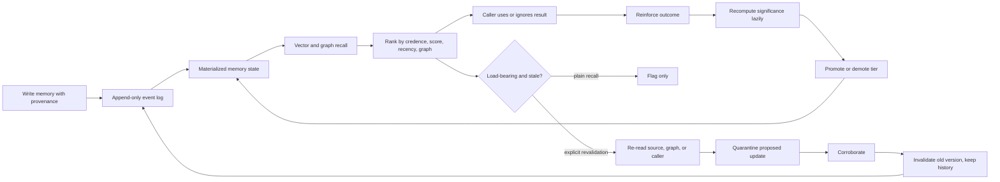

# Shibahama

Shibahama is a usage-aware, reconstructive memory engine for long-running LLM
agents.

It is built for the failure mode where an agent can retrieve old context but
cannot tell whether that context is still current, trusted, load-bearing, or
safe to use. Shibahama keeps memory as state with history: every item carries
provenance, valid time, ingestion time, credence, tier, significance, and an
audit trail. Recall returns contextual candidates, not bare text.

The repository is pre-release. The Rust core, CLI, Python binding, Node binding,
benchmark harness, examples, and Tideline debugger are implemented locally. PyPI
and npm publication are still pending registry credentials or trusted
publishing setup.


## Why This Exists

Most agent memory systems behave like warehouses: write a chunk, embed it, and
retrieve nearest neighbors later. That is useful, but it blurs separate
questions:

- Is this fact still true?
- Where did it come from?
- Has it helped before?
- Is it authoritative or just model-inferred?
- Should it be cheap to retrieve by default?
- If it looks stale, should the agent re-check it before relying on it?

Shibahama keeps those axes separate.

- **Currency** comes from bi-temporal validity: `valid_from`, `valid_to`, and
  `ingested_at`.
- **Credence** comes from provenance and corroboration.
- **Significance** comes from usage, outcomes, decay, contradiction, and graph
  centrality.
- **Tier** controls retrieval cost: hot, warm, or cold.
- **Reconstruction** is explicit: stale important memories can be revalidated
  and replaced without overwriting history.

The name comes from the rakugo story about a memory that is hidden, preserved,
and later reintroduced at the moment it can be understood correctly. See
[`docs/why-shibahama.md`](docs/why-shibahama.md).

## Closed Loop



The important rule is that ordinary recall is read-only except for surfaced
access recording. Reconstruction does not run as an invisible side effect of a
plain read.

## What Is Implemented

The current repository includes:

- Rust core crate with `write`, `recall`, `reinforce`, `why`, `timeline`, and
  async facade APIs.
- Append-only event log plus redb-backed materialized state.
- UUIDv7 ids, provenance, bi-temporal memory items, credence tiers, hot/warm/cold
  tiers, and schema versioning.
- In-process HNSW vector index plus a Qdrant transport adapter boundary.
- Lazy significance scoring with deterministic `why()` explanations.
- Graph entities and bi-temporal relations for expansion, contradiction, and
  supersession.
- Reconstruction gate, quarantine, corroboration, and invalidate-not-overwrite
  replacement flow.
- Human signal APIs for challenge, affirm, correct, pin, and unpin, with
  append-only actor/timestamp/reason audit events.
- Read-safety filters for stored role/directive-looking content.
- CLI and optional HTTP server mode with namespace filtering, API-key auth, and
  metadata-only request logs.
- Python and Node bindings, including LangChain-style memory adapters.
- Tideline, a React/Vite visual debugger for replaying memory/event sessions.
- Local benchmark harnesses for CurrencyBench and a coding-agent memory task.

Architecture details live in [`docs/architecture.md`](docs/architecture.md), and
plain-language concepts live in [`docs/concepts.md`](docs/concepts.md).

## When Not To Use Shibahama

Use plain RAG, keyword search, or long context when the job is stateless one-shot
QA over mostly static content. If the whole useful corpus fits cheaply in
context, if answers do not depend on supersession or current validity, or if you
only need nearest-neighbor snippets, Shibahama's event log, credence, tiering,
and reconstruction machinery may be unnecessary.

Shibahama is aimed at continuity tasks where facts recur and change, stale
answers are costly, and it matters to inspect why a memory is trusted,
challenged, cold, or superseded. The benchmark boundary is documented in
[`docs/null-hypothesis.md`](docs/null-hypothesis.md).

## Quickstart From This Checkout

Published packages are not available yet, so use the repository directly.

Run the Rust example:

```sh
cargo run --manifest-path examples/rust/quickstart/Cargo.toml
```

Build the Python binding and run the Python example:

```sh
python -m venv .venv
. .venv/bin/activate
python -m pip install --upgrade pip maturin
(
  cd bindings/python
  python -m maturin develop
)
python examples/python/basic_memory.py
```

Build the Node binding and run the Node example:

```sh
(
  cd bindings/node
  npm install
  npm run build
)
node examples/node/basic-memory.mjs
```

Try the CLI:

```sh
cargo run -p shibahama-cli -- init --path shibahama.redb --dimensions 2
cargo run -p shibahama-cli -- write \
  --path shibahama.redb \
  --content "Project prefers boring, durable storage." \
  --vector "0,1" \
  --source-kind user
cargo run -p shibahama-cli -- recall \
  --path shibahama.redb \
  --query-vector "0,1" \
  --top-k 1
```

## Core API Shape

Rust callers open an embedded engine with a vector index, write memories with
provenance, and recall by supplying query embeddings from their own embedding
model.

```rust
use shibahama_core::api::{Shibahama, WriteEmbedding};
use shibahama_core::model::{AccessOutcome, Provenance, SourceKind};
use shibahama_core::storage::MemoryWriteEvent;
use shibahama_core::vector::HnswVectorIndex;
use time::OffsetDateTime;

let mut engine = Shibahama::open("memory.redb", HnswVectorIndex::new(2))?;
let now = OffsetDateTime::now_utc();

let item = engine.write_with_embedding(
    MemoryWriteEvent::new(
        "Do not suggest the legacy queue migration again.",
        Provenance::new(SourceKind::User, Some("retro-notes".to_owned()), "agent"),
        now,
        now,
    ),
    WriteEmbedding {
        vector: &[0.0, 1.0],
        index_name: "default",
        model: "caller-embedding-model",
        model_version: "v1",
    },
)?;

let request = engine
    .recall_request(&[0.0, 1.0], 5, now)
    .with_raw_query_context("queue migration options");
let recalled = engine.recall(&request)?;

engine.reinforce(item.id, AccessOutcome::Cited)?;
let why = engine.why(item.id)?;
```

For complete runnable snippets, see [`examples/`](examples/). For generated API
notes, see [`docs/api/README.md`](docs/api/README.md).

## Tideline Debugger

Tideline is the visual debugger for the memory loop. It can replay a recorded
session, scrub event sequence time, inspect tier movement, show why a memory was
returned, compare two points in a session, and export a shareable clip.

Start the server:

```sh
cargo run -p shibahama-cli -- serve --path shibahama.redb --dimensions 2 --api-key dev
```

Start Tideline:

```sh
(
  cd tideline
  npm install
  npm run dev
)
```

Open the Vite URL and point it at `http://127.0.0.1:8765` with API key `dev`.
The UI consumes read-only `/tideline/snapshot`, `/tideline/recording`, and
`/tideline/live` endpoints, plus `why` traces for selected memories.

## Benchmark Snapshot

Checked-in local benchmark artifacts are under
[`benchmarks/results/`](benchmarks/results/). These are deterministic local smoke
results, not hosted all-systems claims.

CurrencyBench injects fact changes mid-stream and measures whether the memory
system returns the current fact rather than the stale one:

| Suite | System | Queries | Accuracy | Stale Answer Rate | Mean Token Cost | p95 ms | Status |
| --- | --- | ---: | ---: | ---: | ---: | ---: | --- |
| currencybench | shibahama | 12 | 1.000 | 0.000 | 5.917 | 0.719 | ok |
| currencybench | warehouse | 12 | 0.000 | 1.000 | 11.833 | 0.017 | ok |

The coding-agent benchmark harness remains experimental and no longer has a
checked-in result artifact. The runnable `examples/coding-agent/` demo is kept
separate from benchmark claims.

The checked-in `ablation-local` artifact isolates significance,
reconstruction/supersession, and graph expansion toggles. Full Shibahama scores
`1.000` accuracy; each single-feature ablation scores `0.667` and fails the case
tied to the removed behavior.

Run the local CurrencyBench comparison after building the Python binding:

```sh
python benchmarks/run.py \
  --suite currencybench \
  --systems shibahama,warehouse \
  --output benchmarks/results/currencybench-local.json \
  --markdown benchmarks/results/currencybench-local.md
```

Benchmark methodology and current scope are documented in
[`docs/benchmarks.md`](docs/benchmarks.md).

## Security Posture

Shibahama treats memory as untrusted input.

- Writes require provenance.
- Web and model-authored memories default to lower credence.
- Recall sorts by credence before weighted score.
- Instruction memories are separated from fact memories and excluded by default.
- Stored role/directive-looking text is neutralized at read time.
- Server logs are metadata-only and avoid memory content, raw query text, and
  embeddings.
- The default redb store is plaintext at rest. The encryption trait is an
  extension point, not active encryption.

Read [`docs/security.md`](docs/security.md) before using Shibahama with
sensitive stores.

## Repository Layout

| Path | Purpose |
| --- | --- |
| `core/` | Rust core library and memory semantics. |
| `shibahama-cli/` | CLI and optional HTTP server mode. |
| `bindings/python/` | PyO3/maturin Python package. |
| `bindings/node/` | napi-rs ESM/CJS Node package. |
| `tideline/` | React/Vite visual debugger. |
| `benchmarks/` | Benchmark harnesses, adapters, datasets, and checked-in local results. |
| `examples/` | Runnable Rust, Python, Node, and coding-agent examples. |
| `docs/` | Architecture, concepts, security, performance, ADRs, API reference, and launch notes. |

## Development Gates

Run the Rust gate:

```sh
scripts/ci/rust.sh
```

Run binding smoke checks:

```sh
scripts/ci/python-binding-smoke.sh
scripts/ci/node-binding-smoke.sh
```

Run the local correctness smoke:

```sh
python scripts/ci/correctness-smoke.py
```

Or enter the pinned Nix shell:

```sh
nix develop
```

## Release State

The workspace version is `0.1.0`, but the release is not published yet.

Still pending:

- TestPyPI/PyPI publish for `pip install shibahama`.
- npm publish for `npm install shibahama`.
- final `v0.1.0` tag and registry publication.
- LoCoMo and LongMemEval benchmark runs with real dataset exports.
- citable CurrencyBench archive/DOI submission.
