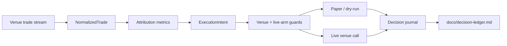

# WhaleMirror (`stonks-cli`)


WhaleMirror is a paper-first, Rust-backed copy-observability project for SG-legal crypto venues. The first target venue is Hyperliquid. The repo is still named `stonks-cli` for package and command stability, but the active product identity is WhaleMirror.

The goal is not to sell an AI trading bot. The goal is to measure whether selected wallets have durable edge after funding, fees, slippage, decay, and survivorship bias, then mirror them only behind explicit risk caps and an auditable ledger.

## Status

Phase 0 pivot is in progress.

- Current product: WhaleMirror, Hyperliquid-first.
- Current implementation: reusable config, scheduler, storage, journal, guard, Rust hotpath, and new venue-neutral WhaleMirror primitives.
- Current default: paper and dry-run only.
- Deprecated surface: equity analysis, generic stock MCP framing, and SG Polymarket execution.

See:

- [Product decisions](docs/product-decisions.md)
- [Decision ledger](docs/decision-ledger.md)
- [Runtime primitives](docs/whalemirror-runtime-primitives.md)
- [Pivot plan](WORKON-PIVOT-ASAP.md)

## What WhaleMirror Does

WhaleMirror is being built around four surfaces:

- Hyperliquid trade ingestion into a normalized internal trade model.
- Wallet attribution using expectancy, Sharpe, rolling decay, survivorship-adjusted PnL, leverage, and funding costs.
- Paper-first mirror decisions with follower-bankroll-aware sizing, stop losses, cooldowns, and explicit live arm gates.
- Public journal and ledger entries that show losses and wins with equal prominence.

## Quickstart

Install locally:

```console
$ git clone https://github.com/gongahkia/stonks-cli
$ cd stonks-cli
$ python3 -m venv .venv
$ source .venv/bin/activate
$ python3 -m pip install -U pip
$ python3 -m pip install -e ".[dev]"
```

Sanity check:

```console
$ stonks-cli --help
$ stonks-cli doctor
$ stonks-cli config init
$ stonks-cli config show
```

Paper-mode fixture smoke test:

```console
$ PYTHONPATH=src python - <<'PY'
from stonks_cli.whalemirror.guards import evaluate_execution_guards
from stonks_cli.whalemirror.models import MirrorMode, Venue

print(evaluate_execution_guards(venue=Venue.HYPERLIQUID, mode=MirrorMode.PAPER))
print(evaluate_execution_guards(venue=Venue.HYPERLIQUID, mode=MirrorMode.LIVE))
PY
```

Expected output:

```text
[]
['live_trading_not_armed:STONKS_CLI_HYPERLIQUID_LIVE_ARMED']
```

That fixture proves the current default: paper mode can run without venue credentials, while live mode fails closed unless explicitly armed.

## Live Guard

Live execution is disabled unless the venue-specific arm flag is set. For Hyperliquid:

```console
$ export STONKS_CLI_HYPERLIQUID_LIVE_ARMED=armed
```

The Phase 1 live budget is capped at USD 200, with sub-USD 50 order notional until the live gate and scale gate are satisfied. No code path should raise notional automatically before the 60-day live validation and 7 consecutive green weeks.

## SG-Legal Venue Policy

Dogfooding and execution are constrained to venues that are legal and operable for an SG resident without circumvention.

Current and candidate venues:

| Venue | Status |
| --- | --- |
| Hyperliquid | Phase 1 target. |
| Solana / EVM DEXes | Candidate Phase 2 venues. |
| OKX / Bybit | Candidate later venues after accepting API-key custody risk. |
| Polymarket | Out of scope for SG execution. Historical material only. |
| Kalshi | Out of scope. |
| Sportsbooks | Out of scope. |

No README, runbook, or command example should be read as instructions to open Polymarket, Kalshi, sportsbook, or circumvention-based positions from Singapore.

## Architecture



The existing Rust hotpath remains the port-forward layer for low-latency state cache, guarded order construction, and order lifecycle tracking. Existing Polymarket-specific code is retained only as historical implementation material until the Hyperliquid surface replaces it.

## Current CLI Surface

The installed command remains:

```console
$ stonks-cli --help
```

Useful stable commands:

```console
$ stonks-cli version
$ stonks-cli doctor
$ stonks-cli config init
$ stonks-cli config where
$ stonks-cli config show
$ stonks-cli config validate
```

The old equity commands and generic stock MCP story are deprecated product surfaces. They may still exist in code during the Phase 0 removal pass, but they are not the active roadmap. The old Polymarket commands are also not current SG live execution guidance.

## Out Of Scope

- Equity analysis as the core product.
- Generic stock MCP tooling.
- Polymarket execution from Singapore.
- Kalshi.
- Sportsbooks.
- Prediction markets that take stakes on event outcomes from restricted jurisdictions.
- "AI day-trading bot" positioning.
- Unsupported alpha claims without a public ledger.

## Legal

This project is provided for educational and informational purposes only.

- Not financial advice: outputs, metrics, rankings, fixtures, sizing suggestions, and ledgers are not investment, legal, tax, or accounting advice.
- No warranty: use at your own risk. The authors and contributors make no guarantees about correctness, uptime, venue access, fill quality, or fitness for a particular purpose.
- Venue responsibility: users are responsible for complying with venue terms, local law, tax rules, and data-use restrictions.
- SG posture: this repo does not provide SG execution guidance for Polymarket, Kalshi, sportsbooks, or restricted prediction-market venues.
- Local storage: state, journals, ledgers, fixtures, and reports may be written to local disk.
