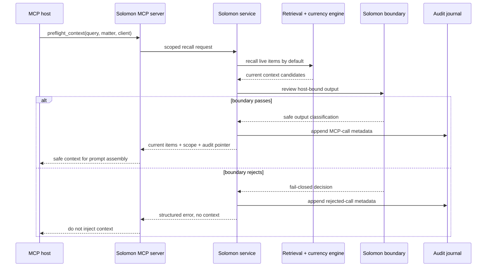

<!-- SPDX-License-Identifier: Apache-2.0 -->

# MCP preflight

```mermaid
sequenceDiagram
    participant H as MCP host
    participant M as Solomon MCP server
    participant S as Solomon service
    participant R as Retrieval + currency engine
    participant B as Solomon boundary
    participant A as Audit journal

    H->>M: preflight_context(query, matter, client)
    M->>S: scoped recall request
    S->>R: recall live items by default
    R-->>S: current context candidates
    S->>B: review host-bound output
    alt boundary passes
        B-->>S: safe output classification
        S->>A: append MCP-call metadata
        S-->>M: current items + scope + audit pointer
        M-->>H: safe context for prompt assembly
    else boundary rejects
        B-->>S: fail-closed decision
        S->>A: append rejected-call metadata
        S-->>M: structured error, no context
        M-->>H: do not inject context
    end
```
