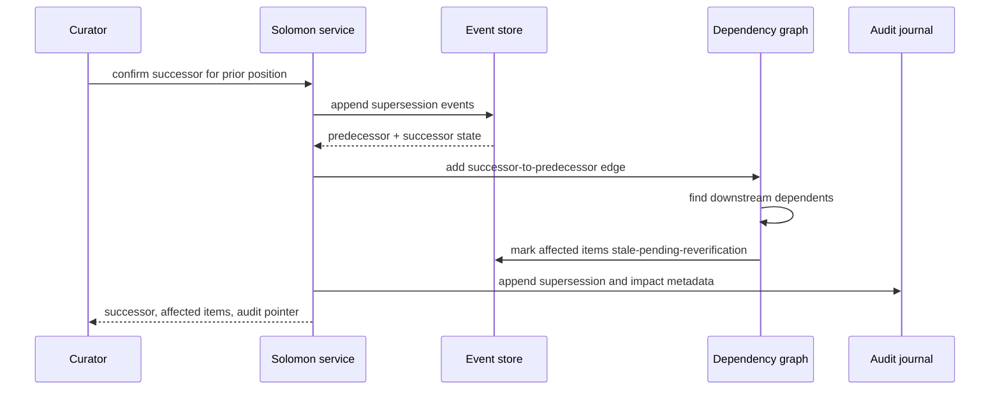

<!-- SPDX-License-Identifier: Apache-2.0 -->

# Supersession propagation

```mermaid
sequenceDiagram
    participant C as Curator
    participant S as Solomon service
    participant E as Event store
    participant G as Dependency graph
    participant A as Audit journal

    C->>S: confirm successor for prior position
    S->>E: append supersession events
    E-->>S: predecessor + successor state
    S->>G: add successor-to-predecessor edge
    G->>G: find downstream dependents
    G->>E: mark affected items stale-pending-reverification
    S->>A: append supersession and impact metadata
    S-->>C: successor, affected items, audit pointer
```
