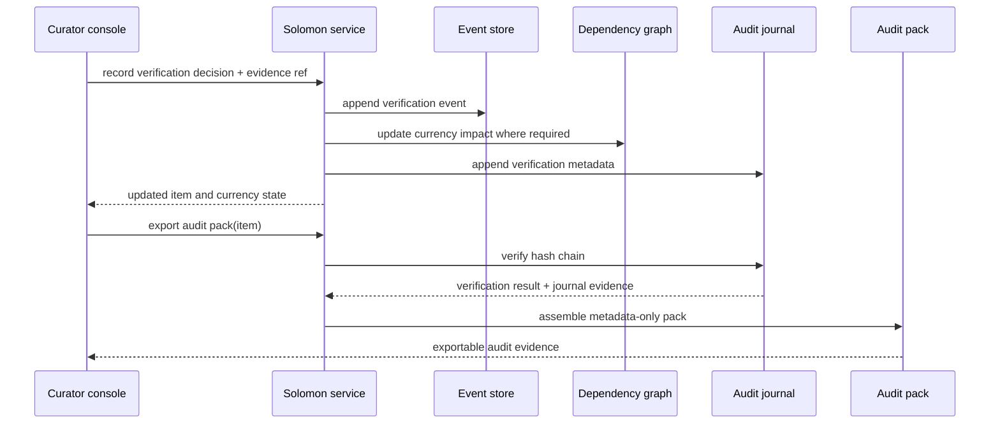

<!-- SPDX-License-Identifier: Apache-2.0 -->

# Verification and audit pack

```mermaid
sequenceDiagram
    participant C as Curator console
    participant S as Solomon service
    participant E as Event store
    participant G as Dependency graph
    participant A as Audit journal
    participant P as Audit pack

    C->>S: record verification decision + evidence ref
    S->>E: append verification event
    S->>G: update currency impact where required
    S->>A: append verification metadata
    S-->>C: updated item and currency state
    C->>S: export audit pack(item)
    S->>A: verify hash chain
    A-->>S: verification result + journal evidence
    S->>P: assemble metadata-only pack
    P-->>C: exportable audit evidence
```
