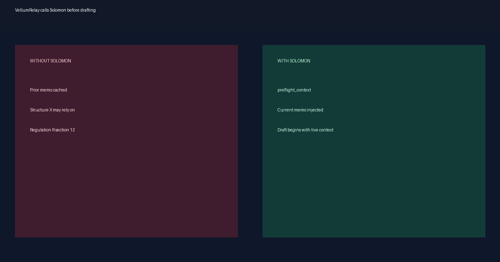

<!-- SPDX-License-Identifier: Apache-2.0 -->

# Solomon

**MCP-native currency infrastructure for verified legal knowledge.**

Solomon records why an internal legal position is current, stale-pending-reverification, superseded, retired, or
contested. It does not decide the law or replace lawyer review.

## Start here

- [Repository README](https://github.com/gongahkia/solomon)
- [MCP installation](./mcp/install.md)
- [Positioning](./positioning.md)
- [One-pager](./one-pager.md) and [PDF](https://github.com/gongahkia/solomon/blob/main/output/pdf/solomon-one-pager.pdf)
- [Known limitations](./known-limitations.md)

## Architecture and evidence

- [Architecture](./architecture.md)
- [Runtime sequence diagrams](./diagrams/README.md)
- [Boundary audit checklist](./boundary-audit-checklist.md)
- [Audit evidence and regulatory mapping](./regulatory-evidence.md)

## Demonstrations

- [Stale house-view scenario](https://github.com/gongahkia/solomon/tree/main/examples/scenarios/stale-house-view)
- [Vendor integration scenario](https://github.com/gongahkia/solomon/tree/main/examples/scenarios/01-vendor-integration)
- [Curator console walkthroughs](./console/index.md)

## Jurisdictions

- [Jurisdiction matrix](./jurisdictions/index.md)
- [Singapore PDPA](./jurisdictions/sg/pdpa.md)
- [Singapore AI governance](./jurisdictions/sg/pdpc-ai.md)
- [Law Society of Singapore AI advisory](./jurisdictions/sg/lawsoc.md)
- [Singapore authority sources](./jurisdictions/sg/canonical-sources.md)
- [UK AI, legal-services supervision, and data protection](./jurisdictions/uk/ai-data-protection.md)
