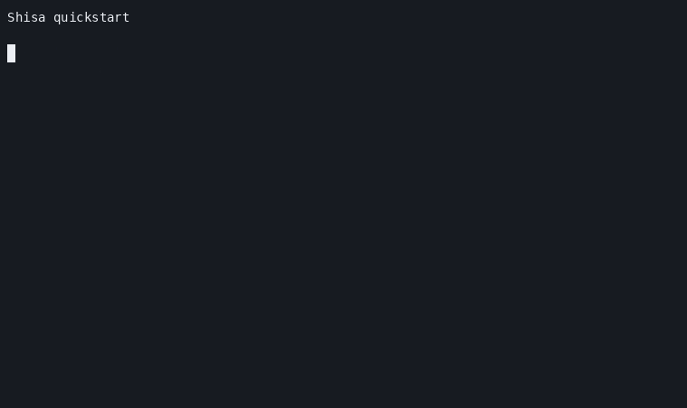

# Quickstart



## 1. Build

```sh
git clone https://github.com/gongahkia/shisa.git
cd shisa
zig build debug
```

## 2. Start the daemon

```sh
./zig-out/bin/shisad --foreground
```

Keep that terminal open for a local smoke run. For regular use, run `shisad` from a user service.

## 3. Add the shell hook

Replace `/path/to/shisa` with the cloned repo path.

<div class="shisa-shell-tabs">
<input type="radio" name="shell-tabs" id="tab-zsh" checked>
<input type="radio" name="shell-tabs" id="tab-bash">
<input type="radio" name="shell-tabs" id="tab-fish">
<input type="radio" name="shell-tabs" id="tab-nu">
<input type="radio" name="shell-tabs" id="tab-pwsh">
<label for="tab-zsh">zsh</label>
<label for="tab-bash">bash</label>
<label for="tab-fish">fish</label>
<label for="tab-nu">nu</label>
<label for="tab-pwsh">pwsh</label>
<div class="shell-panel panel-zsh">

```sh
export SHISA_BIN=/path/to/shisa/zig-out/bin/shisa
source /path/to/shisa/init/shisa.zsh
```

</div>
<div class="shell-panel panel-bash">

```sh
export SHISA_BIN=/path/to/shisa/zig-out/bin/shisa
source /path/to/shisa/init/shisa.bash
```

</div>
<div class="shell-panel panel-fish">

```fish
set -gx SHISA_BIN /path/to/shisa/zig-out/bin/shisa
source /path/to/shisa/init/shisa.fish
```

</div>
<div class="shell-panel panel-nu">

```nu
$env.SHISA_BIN = "/path/to/shisa/zig-out/bin/shisa"
source /path/to/shisa/init/shisa.nu
```

</div>
<div class="shell-panel panel-pwsh">

```powershell
$env:SHISA_BIN = "/path/to/shisa/zig-out/bin/shisa"
. /path/to/shisa/init/shisa.ps1
```

</div>
</div>

Put the matching block in the shell startup file:

| Shell | Startup file |
| --- | --- |
| zsh | `~/.zshrc` |
| bash | `~/.bashrc` or `~/.bash_profile` |
| fish | `~/.config/fish/config.fish` |
| nushell | `~/.config/nushell/config.nu` |
| PowerShell | `$PROFILE` |

## 4. Verify

```sh
./zig-out/bin/shisa doctor
./zig-out/bin/shisa explain
```

<details>
<summary>Troubleshooting</summary>

| Symptom | Check |
| --- | --- |
| Prompt falls back to the current directory | `shisad --foreground` is running and the socket path matches `shisa doctor`. |
| Shell startup errors on `source` | `SHISA_BIN` points to an executable `zig-out/bin/shisa`. |
| Fish prompt shows stale output | Remove `~/.config/shisa/last-prompt` and run `fish_prompt` again. |
| Async fields do not update | Run the shell integration test listed in [Shells](shells.md) for that shell. |
| Config changes do not show | Run `shisa explain` and confirm the expected module pipeline. |

</details>
