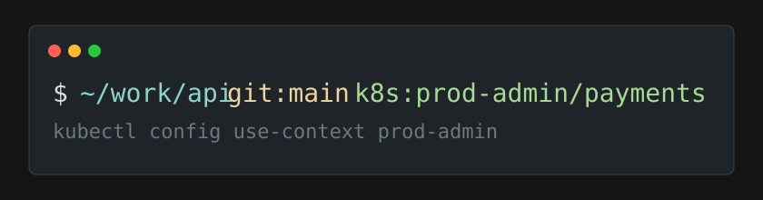

# kubectx

Kubernetes current context segment for Shisa.



Renders:

```text
k8s:<context>/<namespace>
```

Empty kubeconfig, empty current context, or missing context renders an empty segment.

## Install

```sh
shisa plugin trust kubectx
shisa plugin install kubectx --yes --plugin-sandbox-strict
```

## Behavior

- Reads `KUBECONFIG` when present.
- Splits `KUBECONFIG` on `:` for macOS/Linux multi-file configs.
- Uses `~/.kube/config` when `KUBECONFIG` is unset.
- Merges files with first-wins semantics for `current-context` and context map entries.
- Defaults namespace to `default` when the current context has no namespace.
- Parses kubeconfig YAML in Lua; no `kubectl`, no `os.execute`, no shell-out.

## Manifest

Capabilities:

```lua
fs_read = { "~/.kube/**", "$KUBECONFIG" }
fs_watch = { "~/.kube/**", "$KUBECONFIG" }
env_read = { "KUBECONFIG" }
exec = false
net = false
```

The module is designed as cached: `update` recomputes from kubeconfig content and `fs_watch` declares the watched scopes. Shisa plugin API v1 has no dedicated `module_class` manifest field.

## Test

```sh
lua test/run.lua
shisa plugin lint .
shisa plugin doctor .
```
